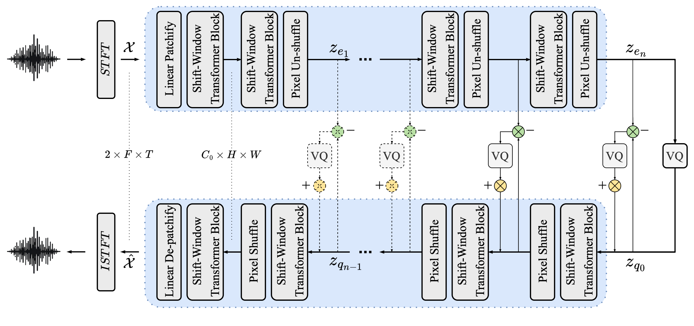
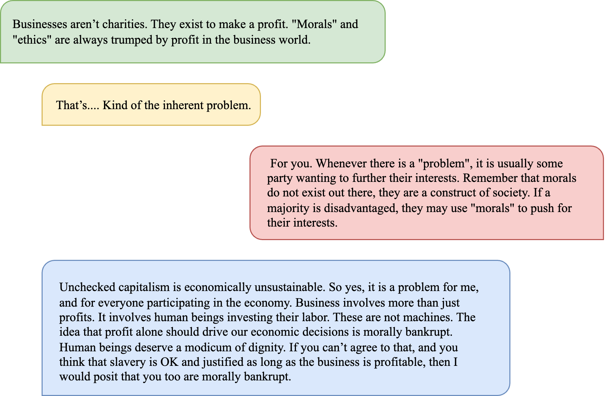
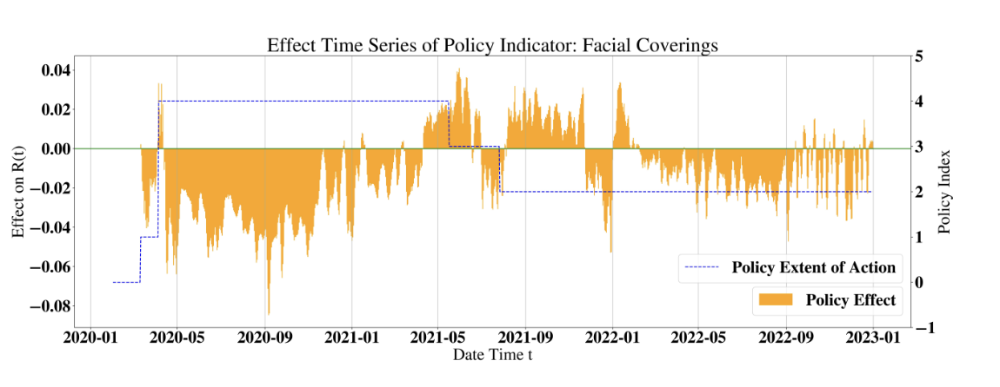

I am a second-year master student in <a href="https://www.ese.upenn.edu">Department of Electrical and Systems Engineering</a> at the <a href="https://www.upenn.edu">University of Pennsylvania</a> with a concentration on Machine Learning and Data Science. I received my dual B.Sc. in Data Science from <a href="https://www.dukekunshan.edu.cn">Duke Kunshan University</a> and <a href="https://www.duke.edu">Duke University</a>, where I worked closely with <a href="https://diaoenmao.com/">Enmao Diao</a> and <a href="https://scholars.duke.edu/person/Peng.Sun1">Peng Sun</a>.

My research interest covers a wide range of topics related to learning representations and modern deep generative models:

<ul>
  <li><strong style="font-weight: bold;">Discrete Representation Learning</strong>: advancing discrete latent variable models for generative models, efficient data compression, and multimodal application</li>
  <li><strong style="font-weight: bold;">Efficient LLMs</strong>: optimizing LLM decoding performance through improved KV cache mechanism and better long-context understanding ability</li>
</ul>

I am actively seeking a CS / ECE Ph.D. position related to Machine Learning and Natural Language Processing starting 2025 Fall.

<!-- Spacing achieved through CSS margin for the table -->
<table style="margin-top: 20px;">
  <tr>
    <td>
      <strong>Email</strong>: tracygu [at] seas [dot] upenn [dot] edu 
      <strong>Google Scholar</strong>: <a href="https://scholar.google.com/citations?user=xdAB6asAAAAJ&hl=en">@scholar</a> 
    </td>
  </tr>
  <tr>
    <td>
      <strong>Github</strong>: <a href="https://github.com/yzGuu830">@github/yzGuu830</a>  
      <strong>Linkedin</strong>: <a href="https://www.linkedin.com/in/yuzheguu">@in/yuzheguu</a> 
    </td>
  </tr>
</table>

   

<h2>News</h2>

<!-- Add class to the News section to scope the bullet styling -->

  <ul>
    <li>
      [Sep 20, 2024]
      Our work <a href="https://arxiv.org/abs/2404.19441">"ESC: Efficient Speech Coding with Cross-Scale Residual Vector Quantized Transformers"</a> is accepted to EMNLP 2024 main conference!
    </li>
    <li>
      [Mar 13, 2024]
      My co-authored paper <a href="https://arxiv.org/abs/2404.19007">"How Did We Get Here? Summarizing Conversation Dynamics"</a> is accepted to NAACL 2024 main conference!
    </li>
    <!-- Hidden content starts here -->
    <li id="moreContent" style="display: none;">
      [Jan 16, 2024]
      My independent study @DKU <a href="https://ieeexplore.ieee.org/document/10622693">"Towards Quantification of Covid-19 Intervention Policies from Machine Learning-based Time Series Forecasting Approaches"</a> got accepted to IEEE-ICC 2024!
    </li>
    <li id="moreContent2" style="display: none;">
      [May 26, 2023]
      🎉 Officially graduated from Duke Kunshan / Duke University!
    </li>
    <!-- End of hidden content -->
    <!-- Show More/Show Less Link -->
    <li>
      <a href="#" id="toggleLink" onclick="toggleContent(event);" style="text-decoration: underline; cursor: pointer;">
        show more
      </a>
    </li>
  </ul>

   

<h2>Publications</h2>

<!-- Year on the left, publications on the right, with consistent width -->

  <!-- Year on the left -->
  

    2024
  

  <!-- Publications on the right -->
  

    <!-- First publication -->
    <strong style="font-size: 16px; font-family: Georgia, sans-serif; font-style: italic; font-weight: bold;">ESC: Efficient Speech Coding with Cross-Scale Residual Vector Quantized Transformers</strong> 
    <strong style="font-weight: bold;">Yuzhe Gu</strong>, Enmao Diao 
    <em>Proceedings of EMNLP, 2024</em> 
    <a href="https://arxiv.org/abs/2404.19441">paper</a> / <a href="https://github.com/yzGuu830/efficient-speech-codec">code</a>
      
    <!-- Second publication -->
    <strong style="font-size: 16px; font-family: Georgia, sans-serif; font-style: italic; font-weight: bold;">How Did We Get Here? Summarizing Conversation Dynamics</strong> 
    Yilun Hua, Nicholas Chernogor, <strong style="font-weight: bold;">Yuzhe Gu</strong>, Seoyeon Julie Jeong, Miranda Luo, Cristian Danescu-Niculescu-Mizil 
    <em>Proceedings of NAACL, 2024</em> 
    <a href="https://arxiv.org/abs/2404.19007">paper</a> / <a href="https://github.com/CornellNLP/scd?tab=readme-ov-file">code</a>
      
    <!-- Third publication -->
    <strong style="font-size: 16px; font-family: Georgia, sans-serif; font-style: italic; font-weight: bold;">Towards Quantification of Covid-19 Intervention Policies from Machine Learning-based Time Series Forecasting Approaches</strong> 
    <strong style="font-weight: bold;">Yuzhe Gu</strong>, Peng Sun, Azzedine Boukerche 
    <em>Proceedings of IEEE International Conference on Communications (ICC), 2024</em> 
    <a href="https://ieeexplore.ieee.org/document/10622693">paper</a> / <a href="https://github.com/yzGuu830/epic-quant">code</a>
  

<!-- 
<h2>Publications</h2> -->

<!-- <table>
  <tr>
    <td>
      
    </td>
    <td style="font-size: 16px; font-family: Georgia, sans-serif;">
      <strong style="font-family: Georgia, sans-serif; font-style:italic; font-weight: bold;">ESC: Efficient Speech Coding with Cross-Scale Residual Vector Quantized Transformers</strong> 
      <strong style="font-weight: bold;">Yuzhe Gu</strong>, Enmao Diao 
      <em>Proceedings of EMNLP, 2024</em> 
      <a href="https://arxiv.org/abs/2404.19441">paper</a> / <a href="https://github.com/yzGuu830/efficient-speech-codec">code</a> 
       
      

      We propose Efficient Speech Codec (ESC), a lightweight, parameter-efficient speech codec based on a cross-scale residual vector quantization scheme and transformers. Our model employs mirrored hierarchical window transformer blocks and performs step-wise decoding from coarse-to-fine feature representations. ESC can achieve high-fidelity speech reconstruction with significantly lower complexity than state-of-the-art convolutional codecs.
      

    </td>
  </tr>
</table> -->

<!--    -->

<!-- <table>
  <tr>
    <td>
      
    </td>
    <td style="font-size: 16px; font-family: Georgia, sans-serif;">
      <strong style="font-family: Georgia, sans-serif; font-style:italic; font-weight: bold;">How Did We Get Here? Summarizing Conversation Dynamics</strong> 
      Yilun Hua, Nicholas Chernogor, <strong style="font-weight: bold;">Yuzhe Gu</strong>, Seoyeon Julie Jeong, Miranda Luo, Cristian Danescu-Niculescu-Mizil 
      <em>Proceedings of NAACL, 2024</em> 
      <a href="https://arxiv.org/abs/2404.19007">paper</a> / <a href="https://github.com/CornellNLP/scd?tab=readme-ov-file">code</a> 
       
      

      We introduce the task of summarizing the dynamics of conversations, by constructing a dataset of human-written summaries, and exploring several automated baselines. We evaluate whether such summaries can capture the trajectory of conversations via an established downstream task: forecasting whether an ongoing conversation will eventually derail into toxic behavior. We show that they help both humans and automated systems with this forecasting task.
      

    </td>
  </tr>
</table> -->

<!--    -->

<!-- <table>
  <tr>
    <td>
      
    </td>
    <td style="font-size: 16px; font-family: Georgia, sans-serif;">
      <strong style="font-family: Georgia, sans-serif; font-style:italic; font-weight: bold;">Towards Quantification of Covid-19 Intervention Policies from Machine Learning-based Time Series Forecasting Approaches</strong> 
      <strong style="font-weight: bold;">Yuzhe Gu</strong>, Peng Sun, Azzedine Boukerche 
      <em>Proceedings of IEEE International Conference on Communications (ICC), 2024</em> 
      <a href="https://ieeexplore.ieee.org/document/10622693">paper</a> / <a href="https://github.com/yzGuu830/epic-quant">code</a> 
       
      

      We design a policy-aware time series forecasting model to estimate COVID-19 trends by incorporating temporal information from 16 policy indicators. Through counterfactual analysis, we quantify the causal effect of indicators and propose two static metrics <em>lag period</em> and <em>average effect</em>. Our model verifies the effectiveness of all 16 policy indicators in controlling virus transmission in the US.
      

    </td>
  </tr>
</table> -->